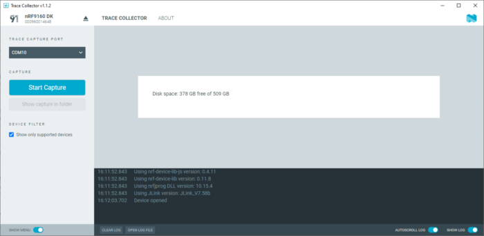

# Capturing the modem trace

You can use Trace Collector to capture the modem trace after programming the required firmware.

Complete the following steps to start capturing:

1. Connect your device to the computer with a Universal Serial Bus (USB) cable and power it on or reset it if it is already connected.

2. Check that your application is working as expected.

3. Open nRF Connect for Desktop and launch the Trace Collector app.

4. Select your device from the drop-down list.

    

5. Click the **Start Capture** button in the side panel. 
   You can see the status in the main view. When the modem is active, the size of the trace file should be increasing.

7. Click **Show capture in folder** to access the trace file. 
   By default, the trace files are stored in `C:\Users\username\AppData\Roaming\nrfconnect\pc-nrfconnect-tracecollector\`.

8. Click **Stop Capture** to stop capturing.

You can view the current trace filename, file size, and free disk space in the Trace Collector tab.

You can access the trace file using the **Show capture in folder** button.