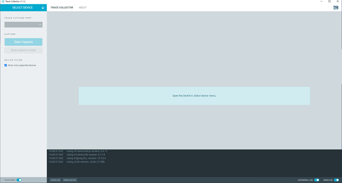
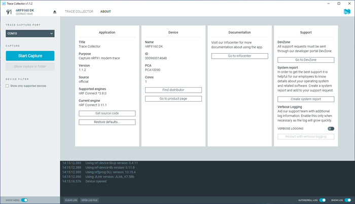

# Overview and user interface

After starting the Trace Collector, the application window is displayed.

The window contains the following elements:

## Select Device

Once you connect a device to the system, it becomes visible and available for selection when you click on **Select device** in the Navigation bar.

## Side Panel

The side panel lets you start capturing, and you can access the captured logs from here.

You can also configure the Trace Collector to automatically filter the connected devices to display only supported devices and ports.

!!! note "Note"
      If you want to capture from Nordic Thingy:91™, deselect **Show only supported devices** so that you can select the correct port.

You can switch between the following application Tabs, using the Navigation bar.

## Trace Collector Tab

When you select a device and start capturing, it displays information about the available disk space and the current trace file.

## About Tab

You can view application information, restore defaults, access source code, and documentation. You also can find information on the selected device, access support tools, and enable verbose logging.

## Log

The Log panel allows you to view the most important log events, tagged with a timestamp. Each time you open the app, a new session log file is created. You can find the Log panel and its controls below the main application window.

- When troubleshooting, to view more detailed information than shown in the Log panel, use **Open log file** to open the current log file in a text editor.
- To clear the information currently displayed in the Log panel, use **Clear Log**. The contents of the log file are not affected.
- To hide or display the Log panel in the user interface, use **Show Log**.
- To freeze Log panel scrolling, use **Autoscroll Log**.